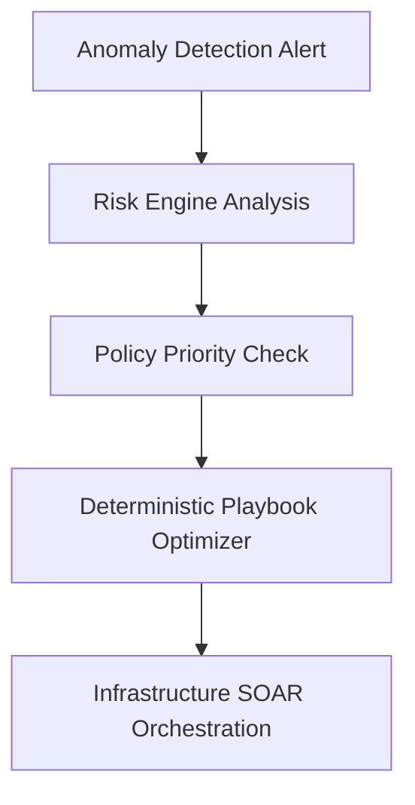
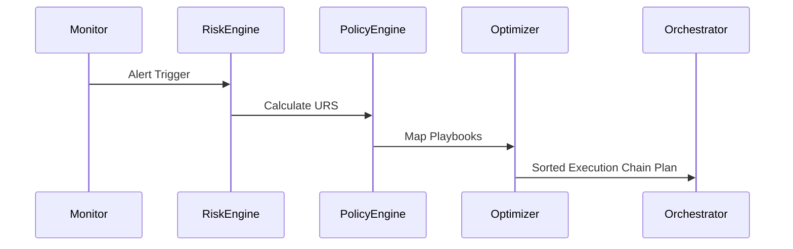

# System Diagram Specifications (Mermaid)

---

## 1. Overall System Architecture

```mermaid
graph TD
    A[Anomaly Detection Alert] --> B[Risk Engine Analysis]
    B --> C[Policy Priority Check]
    C --> D[Deterministic Playbook Optimizer]
    D --> E[Infrastructure SOAR Orchestration]
```

---

## 2. Sequence Lifecycle Diagram

```mermaid
sequenceDiagram
    participant Monitor
    participant RiskEngine
    participant PolicyEngine
    participant Optimizer
    participant Orchestrator

    Monitor->>RiskEngine: Alert Trigger
    RiskEngine->>PolicyEngine: Calculate URS
    PolicyEngine->>Optimizer: Map Playbooks
    Optimizer->>Orchestrator: Sorted Execution Chain Plan
```
